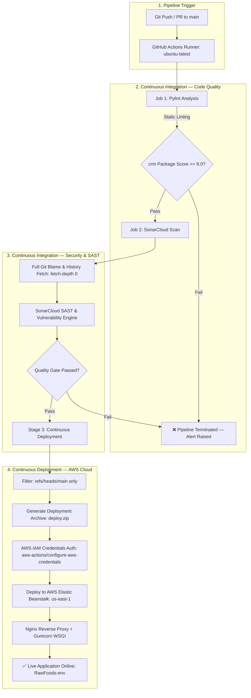

# Automated DevSecOps CI/CD Pipeline — Cloud B2B CRM & CPQ Platform

[](https://github.com/muthumorley/DevOps-Project/actions)
[](https://aws.amazon.com/elasticbeanstalk/)
[](https://sonarcloud.io/)
[](https://pylint.org/)
[](https://www.python.org/)
[](https://www.djangoproject.com/)
[](https://gunicorn.org/)
[](LICENSE)

An enterprise-grade **DevSecOps Continuous Integration & Continuous Deployment (CI/CD) pipeline** built with **GitHub Actions**, **SonarCloud**, **Pylint**, and **AWS Elastic Beanstalk**. 

The pipeline automates static code analysis, security vulnerability scanning (SAST), quality gates, deployment artifact packaging, and zero-downtime deployment to AWS cloud infrastructure for a full-stack **B2B CRM & Configure, Price, Quote (CPQ)** web platform.

---

## 🚀 CI/CD & DevSecOps Architecture

The pipeline follows strict DevSecOps principles: **no code reaches production unless it passes both automated structural quality gates and static security vulnerability scans.**



---

## 🛡️ Pipeline Stages & Quality Gates

The entire workflow is defined in [`.github/workflows/pylint.yml`](.github/workflows/pylint.yml) and consists of three orchestrated jobs:

### 1. Code Quality & Linting (`lint`)
- **Environment**: `ubuntu-latest` with Python 3.9 runtime.
- **Dependency Isolation**: Upgrades `pip` and installs pinned production + CI dependencies from [`requirements.txt`](requirements.txt).
- **Execution**: Runs `pylint crm --ignore=migrations` against the core application module.
- **Enforcement**: Any syntax errors, import anomalies, or structural anti-patterns immediately abort the build.

### 2. Static Application Security Testing & Quality Gate (`sonarqube`)
- **Dependency**: `needs: lint` (Executes only after lint stage succeeds).
- **Tool**: SonarCloud SAST engine via `SonarSource/sonarqube-scan-action@v6`.
- **Scan Depth**: Full checkout (`fetch-depth: 0`) to track commit-level code ownership and differential changes.
- **Security Scope**:
  - Detection of Common Weakness Enumerations (CWEs) and OWASP Top 10 vulnerabilities.
  - Identification of hardcoded credentials, token leaks, and improper input handling.
  - Maintainability, code duplication, and cognitive complexity metrics.
- **Authentication**: Zero credentials stored in code; authenticated using encrypted repository secret `SONAR_TOKEN`.

### 3. Automated Cloud Continuous Deployment (`deploy`)
- **Dependency**: `needs: [lint, sonarqube]` (Strict two-stage gate requirement).
- **Condition**: Only triggers on direct pushes or merged PRs to `refs/heads/main`.
- **Packaging (`deploy.zip`)**:
  - Dynamically packages the application while explicitly stripping unneeded/sensitive files:
    ```bash
    zip -r deploy.zip . -x "deploy.zip" ".git/**" "venv/**" "__pycache__/**" "*.pyc" ".env" ".DS_Store"
    ```
- **AWS Authentication**: Authenticates securely via `aws-actions/configure-aws-credentials@v4` using IAM secrets (`AWS_ACCESS_KEY_ID`, `AWS_SECRET_ACCESS_KEY`, `AWS_SESSION_TOKEN`).
- **Target Infrastructure**: Deploys the versioned artifact (`github-${{ github.run_number }}`) to **AWS Elastic Beanstalk** (`us-east-1`) in environment `RawFoods-env`.

---

## 🔒 Cloud Security & Infrastructure Hardening

| Security Layer | Implementation Details |
|---|---|
| **Secret Management** | Zero secrets in repository. Local development uses `.env` (gitignored). Production variables (`SECRET_KEY`, Stripe keys) are injected via Elastic Beanstalk Environment Properties. |
| **Fail-Fast Configuration** | `cpq_project/settings.py` raises an explicit `RuntimeError` at boot if `SECRET_KEY` is absent, preventing silent fallback to insecure defaults. |
| **Debug Mode Isolation** | `DEBUG` flag is strictly parsed from environment boolean values (`DEBUG = os.getenv('DEBUG', 'False').lower() in ('true', '1')`), eliminating string truthiness bugs in production. |
| **Allowed Hosts Security** | `ALLOWED_HOSTS` dynamically parsed from comma-separated environment variables to prevent HTTP Host Header poisoning. |
| **Static Asset Compression** | WhiteNoise (`CompressedStaticFilesStorage`) serves static files directly from Gunicorn with gzip/Brotli compression, removing S3/CDN complexity for prototype deployments. |
| **WSGI / Reverse Proxy** | Multi-tier architecture: Nginx manages SSL termination and HTTP traffic routing, forwarding requests to Gunicorn WSGI workers running on port 8000. |

---

## 📦 The Workload: Cloud B2B CRM & CPQ Application

The deployed application is a **B2B Food Wholesale CRM and Configure, Price, Quote (CPQ)** system ("Raw Foods") designed to manage end-to-end commercial operations.

### Enterprise CRM / Salesforce & PROS CPQ Alignment

| Raw Foods Architecture | Salesforce Standard Object | Enterprise CPQ Equivalent |
|---|---|---|
| `Lead` model (`LD-YYYY-XXX`) | `Lead` object & Auto-Numbering | Inbound Prospect Capture |
| `convert_lead` workflow | Lead Conversion (`Account` + `Opportunity`) | Opportunity Qualification |
| `Account` & `Opportunity` | `Account` & `Opportunity` | Commercial Hierarchy |
| `Product` & `Category` | `Product2` & `PricebookEntry` | Product Master & Catalog |
| `Quote` & `QuoteItem` | `SBQQ__Quote__c` / `QuoteLineItem` | Multi-line CPQ Configuration |
| Discount & Totals calculation | Pricing Rules / Price Waterfalls | Rule-based Pricing & Discounting |
| Status State Machine | Approval Processes & Stage Transitions | Quote Lifecycle Governance |
| Stripe Checkout Session | Payment Gateway Integration | Order-to-Cash (O2C) Integration |

---

## 📂 Repository Layout

```text
DevOps-Project/
├── .github/
│   └── workflows/
│       └── pylint.yml          # CI/CD: Pylint + SonarCloud + AWS Elastic Beanstalk Deploy
├── cpq_project/                # Django Core Configuration
│   ├── settings.py             # Hardened environment-driven settings
│   ├── urls.py                 # Root routing
│   ├── wsgi.py                 # WSGI entry point (Gunicorn)
│   └── asgi.py                 # ASGI entry point
├── crm/                        # Core CRM & CPQ Application
│   ├── models.py               # Lead, Account, Opportunity, Product, Quote, QuoteItem
│   ├── views.py                # Pipeline logic, CPQ pricing engine, Stripe checkout
│   ├── urls.py                 # Application routes
│   ├── forms.py                # Lead & CPQ forms
│   ├── admin.py                # Django Admin interface
│   ├── tests.py                # Automated unit test suite (14 test cases)
│   └── migrations/             # Database migrations
├── scripts/
│   └── seed_demo.py            # Automated demo data seeder
├── static/                     # CSS stylesheets and UI assets
├── templates/                  # Django HTML5 templates
├── .env.example                # Environment variable template
├── .gitignore                  # Git ignore rules (bytecode, DB, env, caches)
├── manage.py                   # Django CLI management utility
├── Procfile                    # AWS Elastic Beanstalk Gunicorn process configuration
├── requirements.txt            # Pinned dependencies (runtime & CI tools)
├── sonar-project.properties    # SonarCloud scanner configuration
└── LICENSE                     # MIT License
```

---

## 🛠️ Local Development & CI Simulation

### 1. Environment Setup

```bash
# Clone the repository
git clone https://github.com/muthumorley/DevOps-Project.git
cd DevOps-Project

# Create and activate virtual environment
python3 -m venv .venv
source .venv/bin/activate  # On Windows: .venv\Scripts\activate

# Install dependencies
pip install -r requirements.txt
```

### 2. Configure Local Secrets

```bash
cp .env.example .env

# Generate a SECRET_KEY
python -c "from django.core.management.utils import get_random_secret_key; print(get_random_secret_key())"
```

Update `.env` with the generated key and `DEBUG=True`.

### 3. Database Migration & Data Seeding

```bash
# Apply schema migrations
python manage.py migrate

# Seed sample wholesale catalog, leads, accounts, and demo quotes
python scripts/seed_demo.py
```
*Default demo staff credentials: `staff` / `demo12345`*

### 4. Run CI Simulation & Tests Locally

```bash
# 1. Run exact CI linting step
pylint crm --ignore=migrations

# 2. Run automated unit test suite
python manage.py test crm

# 3. Start local development server
python manage.py runserver
```

---

## 📊 CI/CD Metrics & Quality Summary

- **Pipeline Automation**: 100% automated (Zero manual intervention post-push).
- **Deployment Strategy**: Push-triggered automated packaging, AWS IAM credential handshake, and artifact deployment.
- **Traceability**: All cloud deployments tagged with `github-${{ github.run_number }}` mapped to git commit SHAs.
- **Test Suite**: 14 automated unit tests covering pricing logic, discount calculations, status transition guards, and RBAC views.

---

## 📄 License

This project is licensed under the MIT License — see the [LICENSE](LICENSE) file for details.
